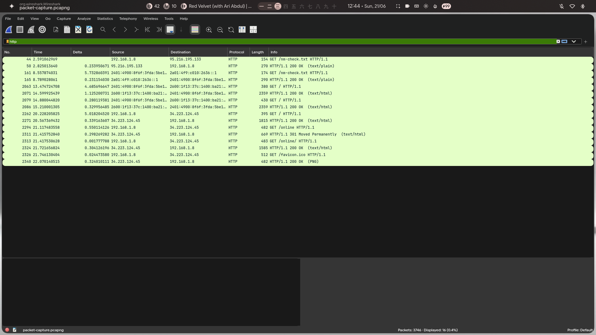
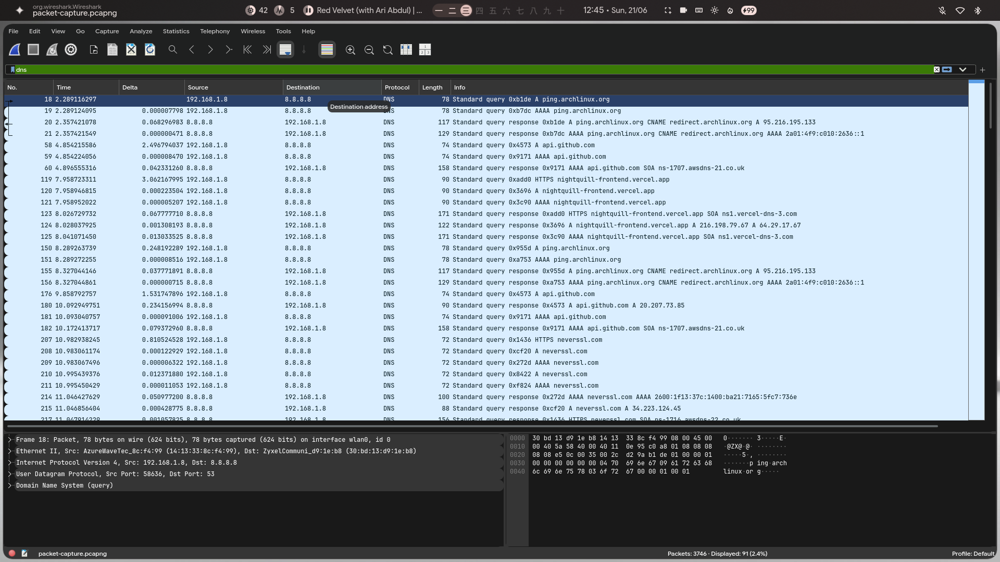
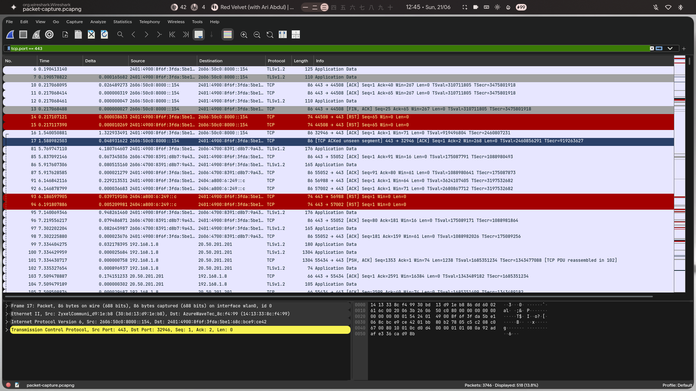

# Week 1 Weekend Assignment
## Network Detective Challenge

# Part 1 – Capture & Analyze Traffic

## Wireshark Evidence

### HTTP Traffic



**Figure 1:** HTTP packets captured while visiting `neverssl.com`.

---

### DNS Traffic



**Figure 2:** DNS queries sent from `192.168.1.8` to Google's DNS server `8.8.8.8`.

---

### HTTPS Traffic



**Figure 3:** Encrypted TLS traffic over port 443.

---

# Traffic Analysis Table

| Website | Protocol | Destination Port | IP Address | Information Visible |
|-----------|---------|----------------|-------------|-------------------|
| neverssl.com | HTTP | 80 | 34.223.124.45 | URLs, GET requests, headers |
| YouTube Music | HTTPS | 443 | Multiple Google IPs | Encrypted traffic only |
| GitHub | HTTPS | 443 | api.github.com (20.20.77.3.85) | Encrypted traffic |
| DNS Server | DNS | 53 | 8.8.8.8 | Domain lookups |

---

# HTTP vs HTTPS Analysis

## neverssl.com

The website `neverssl.com` uses HTTP. Wireshark showed GET requests, response codes, and page resources. Since HTTP does not encrypt traffic, anyone monitoring the network can read the contents.

Examples seen:

- GET / HTTP/1.1
- GET /online HTTP/1.1
- GET /favicon.ico HTTP/1.1
- HTTP/1.1 200 OK
- HTTP/1.1 301 Moved Permanently

---

## YouTube Music

YouTube Music uses HTTPS over port 443. Packet contents are encrypted and only TLS application data is visible. Music streams and account information are protected.

---

## GitHub

GitHub also uses HTTPS. DNS lookups and destination IP addresses are visible, but webpage contents and credentials remain encrypted.

---

# CIA Triad Connection

The HTTP traffic from `neverssl.com` demonstrates the importance of **Confidentiality**. Since HTTP does not encrypt data, an attacker connected to the same network could inspect packet contents and steal sensitive information.

HTTPS protects confidentiality by encrypting communication between the client and server.

---

# AAA Framework Connection

Authentication is the first component that would fail if a login page used HTTP. Usernames and passwords could be captured by attackers, allowing unauthorized access.

Proper encryption protects authentication and helps preserve authorization and accounting mechanisms.

---

# Home Network Information

### IP Address

```
192.168.1.8
```

### Gateway

```
192.168.1.1
```

### DNS Server

```
8.8.8.8
```

### Network

```
192.168.1.0/24
```

### Subnet Mask

```
255.255.255.0
```

### Usable Hosts

```
192.168.1.1 – 192.168.1.254
```

---

# Part 2 – Subnetting Practice

---

## Problem 1

Given:

```
192.168.1.0/24
```

### Total addresses

```
2^(32-24)=256
```

Usable hosts:

```
254
```

### Divide into four equal subnets

Borrow two bits:

```
/24 → /26
```

Subnet mask:

```
255.255.255.192
```

---

### Subnet 1

Network:

```
192.168.1.0/26
```

Usable:

```
192.168.1.1 – 192.168.1.62
```

Broadcast:

```
192.168.1.63
```

---

### Subnet 2

Network:

```
192.168.1.64/26
```

Usable:

```
192.168.1.65 – 192.168.1.126
```

Broadcast:

```
192.168.1.127
```

---

### Subnet 3

Network:

```
192.168.1.128/26
```

Usable:

```
192.168.1.129 – 192.168.1.190
```

Broadcast:

```
192.168.1.191
```

---

### Subnet 4

Network:

```
192.168.1.192/26
```

Usable:

```
192.168.1.193 – 192.168.1.254
```

Broadcast:

```
192.168.1.255
```

---

### Hosts per subnet

```
62 usable hosts
```

---

## Problem 2 – VLSM

Given network:

```
10.0.0.0/24
```

### Engineering (50 hosts)

Network:

```
10.0.0.0/26
```

Usable:

```
10.0.0.1 – 10.0.0.62
```

Broadcast:

```
10.0.0.63
```

---

### Sales (30 hosts)

Network:

```
10.0.0.64/27
```

Usable:

```
10.0.0.65 – 10.0.0.94
```

Broadcast:

```
10.0.0.95
```

---

### HR (10 hosts)

Network:

```
10.0.0.96/28
```

Usable:

```
10.0.0.97 – 10.0.0.110
```

Broadcast:

```
10.0.0.111
```

---

### Servers (10 hosts)

Network:

```
10.0.0.112/28
```

Usable:

```
10.0.0.113 – 10.0.0.126
```

Broadcast:

```
10.0.0.127
```

---

### Largest subnet

Engineering receives the largest subnet because it contains the highest number of hosts.

---

## Problem 3 – Security Connection

Separating departments into different subnets improves security by reducing lateral movement. Servers should not be placed on the same network as user devices.

Firewalls and routers control traffic between subnets and enforce security policies. This design improves:

- Confidentiality
- Integrity
- Availability

and limits the damage caused by compromised machines.

---

# Part 3 – Connecting Everything

---

## Question 1 – CIA Triad in Action

SSH protects confidentiality because all communication is encrypted. However, weak passwords can still allow attackers to compromise authentication.

To mitigate this risk:

- Use SSH keys
- Disable password authentication
- Restrict access with firewalls
- Enable fail2ban

These controls preserve confidentiality and integrity.

---

## Question 2 – AAA Framework

Authentication verifies the user's identity.

Authorization determines what resources users can access.

Accounting records actions for auditing purposes.

If login credentials are transmitted using HTTP, attackers can capture them. Authentication is compromised first, followed by authorization.

HTTPS prevents these attacks by encrypting credentials.

---

## Question 3 – Attack Story

An employee logs into an HR portal using HTTP while connected to public Wi-Fi. Since HTTP traffic is unencrypted, an attacker captures the employee's username and password.

Using the stolen credentials, the attacker gains access to company systems. Because all devices share the same network, the attacker performs lateral movement and reaches sensitive servers.

The attack could have been prevented through:

- HTTPS
- Network segmentation
- Firewalls
- Least privilege
- Logging and monitoring

---

## Question 4 – Linux and Windows Connection

Least privilege supports authorization by ensuring users only possess the permissions necessary for their jobs.

### Linux locations attackers inspect

- `/etc/passwd`
- `/etc/shadow`
- SUID binaries
- File permissions

### Windows logs

Security events are found in:

```
Event Viewer
 => Windows Logs
 => Security
```

Failed login attempts and suspicious activity can be analyzed using these logs.

---

# End of Submission